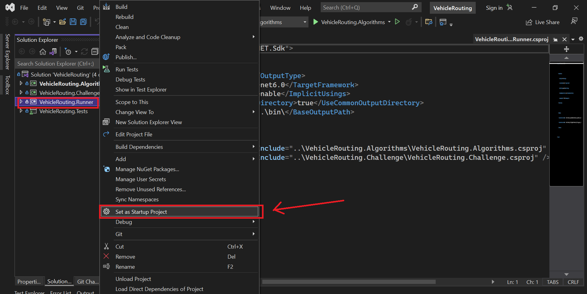
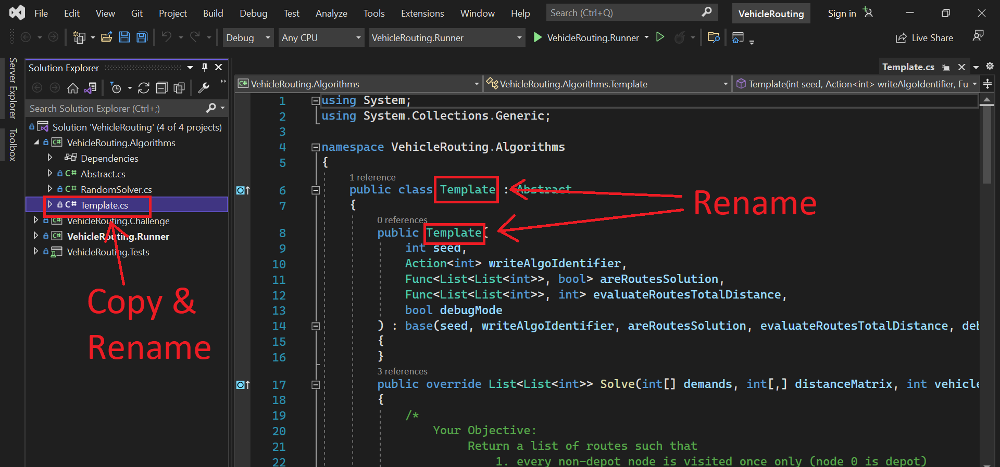
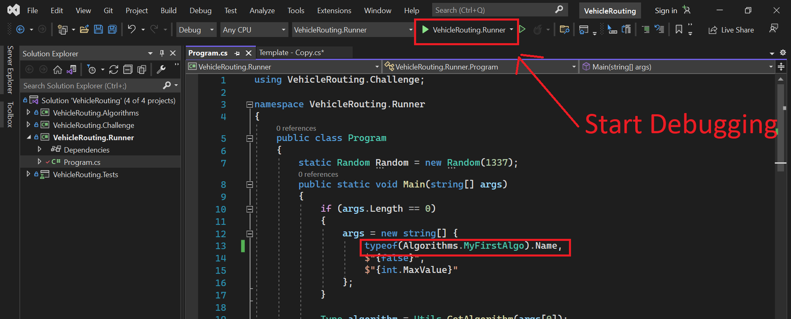

# The Innovation Game - Vehicle Routing Challenge

## Objective
**Capacitated Vehicle Routing Problem** is a combination of the classical Travelling Salesman Problem and the Knapsack Problem. 

The challenge is to develop an algorithm that finds routes which do not exceed the vehicle capacity and have a total distance at least 15% shorter than a naive greedy algorithm.

## Repo Structure

* `VehicleRouting.Algorithms` contains all the uploaded algorithms for this challenge. Any algorithm you develop should go in here
* `VehicleRouting.Challenge` contains the logic for running & verifying algorithms for this challenge
* `VehicleRouting.Runner` contains an executable program for debugging / running your algorithms during development
* `VehicleRouting.Tests` contains tests for the challenge logic 

## Getting Started

1. [Install Visual Studio 2022](https://visualstudio.microsoft.com/vs/)

2. Fork and clone this repo

3. Create a branch for your algorithm
```
git checkout -b <your handle>/algorithm/<algorithm name>
```

3. Open `VehicleRouting.sln` with Visual Studio 2022

4. Set `VehicleRouting.Runner` as your startup project



5. Make a copy of `VehicleRouting.Algorithms\Template.cs` and rename filename & class to your algorithm name



6. Modify `VehicleRouting.Runner\Program.cs` to use your algorithm and start developing / debugging!



7. Open a Pull Request with your branch once you are ready to submit!

## Rules

You should adhere to the following rules if you want to "upload" an algorithm:

1. See `Uploading Algorithms` in the [main docs](https://test.the-innovation-game.com/get-involved) for the non-challenge specific rules

2. Your algorithm must implement the base class in `VehicleRouting.Algorithms\Abstract.cs`:
    * `override` the `Solve` function
    * You must invoke `WriteAlgoIdentifier` every so often with an int that cannot be guessed without running your algorithm
    ```
    // e.g.
    WriteAlgoIdentifier(Random.Next() / routes.Count * routes[0].Sum());
    ```
    * if you need randomness, use the provided `System.Random` instance: `this.Random`

3. If you want to give up on the challenge (e.g. maybe its unsolvable), you should return an empty `List`

4. Your algorithm class name and filename must be `<algorithm_name>.cs`

5. All your utility classes should be contained in a separate namespace `VehicleRouting.Algorithms.<algorithm_name>Utils`

6. If you are improving an existing algorithm, make a copy of the file before making modifications


## Support
[Join our Discord](http://discord.the-innovation-game.com)

## License

TBC
